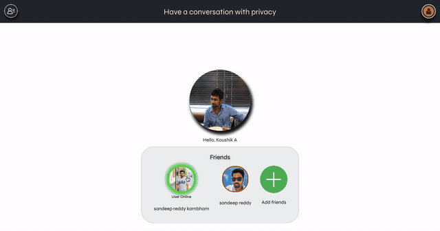

##Chat app 

This is a video call app which is developed using webRTC technology and react.js.  

## Features in app :
  - Login with google 
  - Discover people who have signed up 
  - Send friend request 
  - Respond to a friend request(accept/decline)
  - Start a video call with a friend
  - Share your screen to your friend  
  - Call controls : Video/audio ON/OFF
  - Send messages/files inside call 
  - Save or delete received files 
  - End the call and start a new call

1. Login and Send request - (User-1 screen)

2. Login and accept friend request - (User-2 screen)

3. Call friend - (User-2 screen)

4. Accept Call - (User-1 screen)

5. Chat, File transfer & Screen share (User-2 Screen)

## Experiences gained by developing this project 
**1.** *[React](https://reactjs.org/)* : Project is developed using React as the main focus.
  - Great understanding of working with states and props.
  - Writing class/function compoenents.
  - Working with stateful/stateless components.
  - Writing more stateless components and less stateful components (makes module easily reusable)
  - Lifecycle methods like compoenentDidMount,componentWillUnmount.
  - Event listeners to create an interactive user experience.
  - Rendering of specific components based on states.
  - Inline conditional rendering where a single element(rather than component) is to be rendered depending on state.
  - Working with arrays/objects methods like map,findIndexOf,forEach.
  - Writing in JSX.
  - Updating the state immutabily. 
  - Use of *promises*. 
    
**2.** *[webRTC](https://webrtc.org/)* : This open-source project is used to capture and stream the audio/video media during the call. Once a connection is established it is also used to exchanges text data and also files.
  - Capture data from media devices like audio/video
  - Creating a peerConnection
  - Creating a offer/answer
  - Adding offer to description(local/remote)
  - Sending offer/answer to peer
  - Exchange of ICE candidates
  - Creating a dataChannel for text/file exchange
  
**3.** *[Firebase](https://firebase.google.com/)* : Three main services are used in this project 
  - RTDB (Real Time Database) : This is used have a realtime user status(offline/online/busy) and also to store user profiles, friendlist and requests data. 
  - Authentication : This is used to help users login/signup using a google account. 
  - Hosting : The website is hosted using Firebase hosting and can be accessed using the link below.
  
 To access the developed website, visit : *[Chat-app](https://chatbox-390df.web.app/)*

## How to run on your system 
1. Clone this repository(find the repository URL above)
  
  `$ git clone [repository URL]`
  
2. Make the project your working directory 
  
  `$ cd [local repository]`
  
3. Install the application modules by typing 
  
  `$ npm install`
  
4. Finally run the app by typing
  
  `$ npm start`

This project was bootstrapped with [Create React App](https://github.com/facebook/create-react-app).

